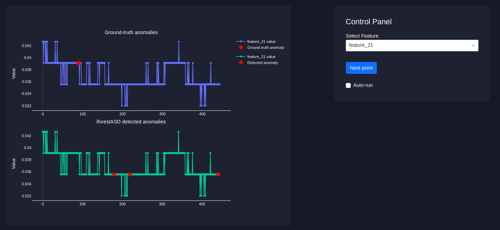

## 🚨 iForestASD: Anomaly Detection in streaming data

### This repository provides a real-time anomaly detection pipeline using iForestASD algorithm.




## 🎯 Executive Summary


### The system includes:

- **A Python ML engine (preprocessing → inference → anomaly detection)**
- **An inference API**
- **A UI dashboard for monitoring results**
- **A Docker-based deployment for full automation**


### 🐳 Entrypoints
- **`app-ml/inference.py`** Entrypoint to run inference pipeline locally
- **`app-ml/inference-api.py`**: API for inference in production / on web-app
- **`app-ui/app.py`**: Interactive dashboard


### Dataset
This repository contains the first 2,000 rows of the **PSM dataset** (`test.csv`).

### iForestASD (iForest for Anomaly Detection in streaming data)
The iForestASD algorithm is implemented using the `pysad` package.

---

## 🚀 Quick Start

### Option 1: Running Application in Docker (Recommended)

```bash
# Clone the repository
git clone <your-repo-url>
cd iforestASD

# Deploy all services with production configuration
docker-compose up --build

# Verify service health
docker-compose ps
docker-compose logs -f

# Access the application
# 🌐 UI Dashboard: http://localhost:8050
# 🔌 Inference API: http://localhost:5001/health
```


### Option 2: Running Application Locally

```bash
# Clone the repository
git clone <your-repo-url>
cd iforestASD

# Create and activate conda environment
conda env create -f environment.yml
conda activate iforestASD

# Run inference in a loop 
python app-ml/entrypoint/inference.py

# Start the inference API tomlink to the application UI
python app-ml/entrypoint/inference_api.py

# Start the UI dashboard in another terminal
cd app-ui
python app.py
```

**Access the application:**
- 🌐 **UI Dashboard**: http://localhost:8050
- 🔌 **Inference API**: http://localhost:5001


## 📁 Project Architecture & Data Flow

```
iforestASD/
├── app-ml/                          
│   ├── entrypoint/                  # Application entrypoints
│   │   ├── inference.py             # Batch / streaming inference (point by point)
│   │   └── inference_api.py         # Real-time inference API (for UI)
│   │
│   ├── src/
│   │   └── pipelines/               # ML pipeline components
│   │       ├── preprocessing.py     # Data preprocessing
│   │       ├── training.py          # Model fitting on initial points
│   │       ├── inference.py         # Runtime anomaly detection
│   │       └── pipeline_runner.py   # Pipeline orchestration
│   │
│   ├── Dockerfile
│   └── requirements.txt
│
├── app-ui/                          # Dashboard (Dash)
│   ├── app.py
│   ├── assets/
│   ├── Dockerfile
│   └── requirements.txt
│
├── common/                          # Shared utilities
│   ├── data_manager.py              # Data I/O, labels, predictions
│   └── utils.py                     # Plotting & helper functions
│
├── config/
│   └── config.yaml                  # Global runtime configuration
│
├── data/
│   ├── raw_data/                    # Input / offline datasets
│   └── prod_data/                   # Streaming / production data
│
├── images/                          
│
├── docker-compose.yml
├── environment.yml
└── README.md

```


Attribution: This project is based on the End-to-End ML-Project-Blueprint 
for Bike Rental Demand Forecasting System proposed by **Timur Bikmukhametov**.

## License

This project is licensed under a custom **Personal Use License**.

You are free to:
- Use the code for personal or educational purposes
- Publish your own fork or modified version on GitHub **with attribution**

You are **not allowed to**:
- Use this code or its derivatives for commercial purposes
- Resell or redistribute the code as your own product
- Remove or change the license or attribution

For any use beyond personal or educational purposes, please contact the author for written permission.


</div> 